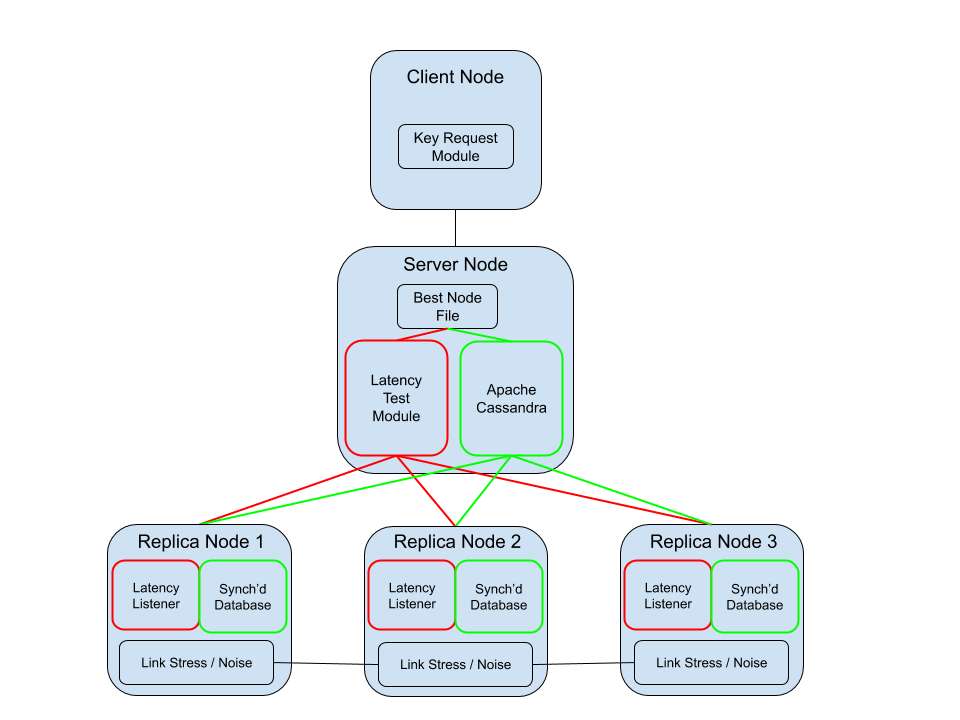

<p align="center">
  
</p>

**Requirements** 
1. Snabb binary file 
2. Apache Cassandra  
  
(Note: These requirements are fulfilled by following **Setup**)  
  
**Setup**
1. Begin in your home directory 
2. Clone this repository: https://github.com/NolanRudolph/MultiDimMonitor.git
3. Clone the snabb repository: https://github.com/snabbco/snabb.git
4. ```cd MultiDimMonitor```
5. ```bash setup.sh``` (if NOT debian, see comments in bash file)
6. ```cd MultiDimSnabb; bash automake.sh```
7. A binary executable named "snabb" can be found in ~/snabb/src. Call ```~/snabb/src/snabb MultiDimSnabb``` to acquire instructions on how to run my program

**Client**  
For client nodes looking to request keys from the server(s), make sure to run ```~/snabb/src/snabb MultiDimSnabb Client --help``` for more information.

**Server**  
For server nodes looking to receive key requests from client(s), make sure to run ```~/snabb/src/snabb MultiDimSnabb Server --help``` for more information.

All personal user space tests were ran on the CloudLab profile ConTools/MultiDimMonitor: https://www.cloudlab.us/p/70d8c132-431e-11ea-b1eb-e4434b2381fc.
